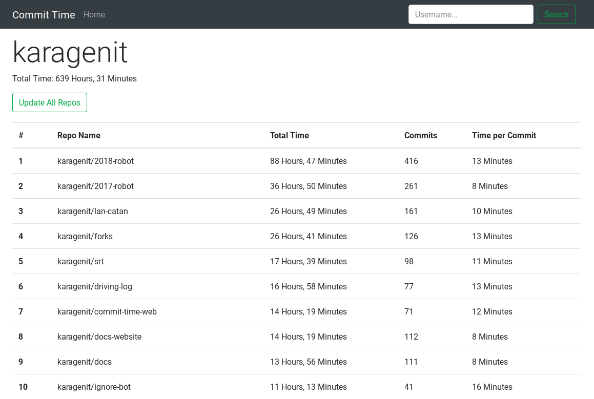

# Commit Time Web

Web Dashboard for [commit-time](https://github.com/karagenit/commit-time).



## Setup

To install the Ruby Gem dependencies, simply run:

```
$ rake setup
```

> **NOTE:** This site uses `Redis` for caching, so you must either have a Redis server running locally or set the `REDIS_URL` environment variable accordingly.

### ENV Variables

In order to access the github API, you need a file named `.env` in the root of the project directory, with the following entries:

```
API_TOKEN=SOME_OAUTH_TOKEN
CLIENT_ID=123
CLIENT_SECRET=123abc
```

The API token is only used for the RSpec tests, and isn't necessary for production environments. Client ID & Client Secret can be obtained by registering a new OAuth Application with Github [here](https://github.com/settings/applications/new).

## Usage

To launch the server via Rack, run:

```
$ rake run
```

and navigate to `localhost:4567`.

### Running Tests

To launch RSpec and Rubocop, simply run:

```
$ rake test
```

## Deploying to Heroku

The `heroku` remote tracks the code pushed to heroku. Use `heroku config:set` to set ENV variables, and then make sure you provisioned a `redis` plug-in for heroku. View diagnostic info with `heroku logs`.
